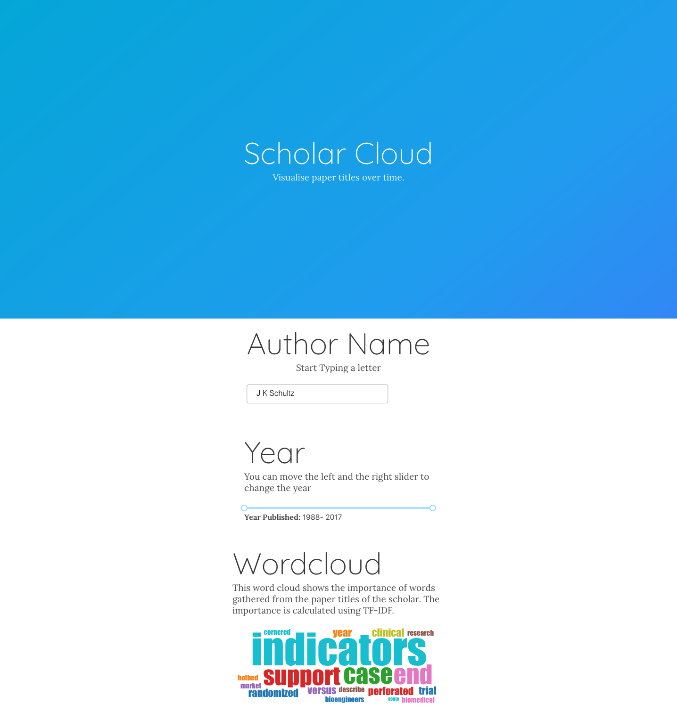
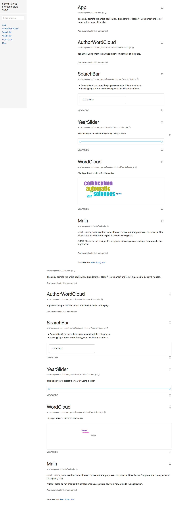

# Scholar Cloud 

`Scholar Cloud ` visualizes the important words from the titles of the papers written by the academicians. The important words themselves are calculated using the TF-IDF measure.

## Interface	

The interface is simple. It mainly has three components 

## 1. The Intelligent Search Bar 

- Start typing in a letter and the search bar shows all the authors we have in the database.

## 2. The Year Slider 

- The slide bar helps you chose the timeline overwhich the wordcloud is calculated
- The sliders first and last year gets updated for every author.

## 3. The Wordcloud

The wordcloud displays the important words for the chosen author and timeline where larger words indicate more important words.

The code for the front end and the back end are in the two separate folders namely 

- [scholar_cloud_frontend](./scholar_cloud_frontend)
- [scholar_cloud_backend](./scholar_cloud_backend)

# PlayGround 

- The frontend has a playground (A live documentation website) that showcases the different components that are developed in the website.
- This can be accessed by navigating into the `scholar_cloud_frontend` and running `npm run styleguide` 
- It looks like the screen shot below.  Here the `SearchBar` and `YearSlider` component are interactive.

# Other documentation 

For further Front end and Back end related documentation please visit the respective repositories.