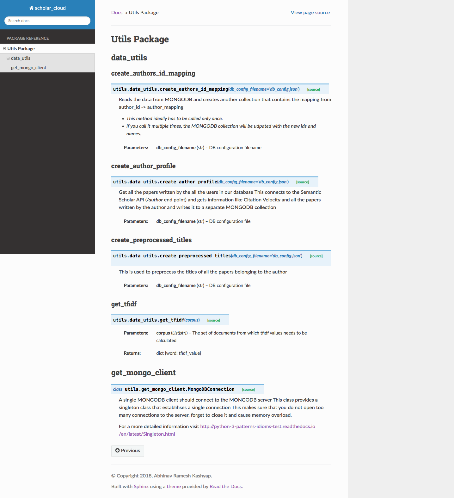

# Scholar Cloud's Backend code 


## General Information 

 The `Scholar Cloud` project aims to visualize the key terms used by academicians in their resepective papers. This repository deals with just the backend (REST services) for the project.

# Contributing 	

## 0. Basic Requirements 

You need to have atlesat have these installed in your system 

- **_Python_**

  You can visit  https://www.python.org/downloads/ for download information 

- **_MongoDB_** 

  You can visit https://docs.mongodb.com/manual/installation/ for download information 

- **_pip_**

  You can visit https://docs.mongodb.com/manual/installation/ for installation. pip is already installed if you have installed python properly 

We recommend running the project inside a virtual environment.

## 1. Run setup.py 

- Clone the project using git 

  `git clone `

- Run the setup.py file to install the dependencies 

  `python setup.py install`	


## 2. Setup the Database config for development 

- As soon as you install the package you should be able to find a command line tool called `setup_db_config` automatically installed for you.
- Run `setup_db_config` from the project directory. It will ask you a series of questions to generate a db configuration file for development. We suggest that you keep the default configuration unless absolutely necessary that you need to change 


### 3. Downloading Semantic Scholar Corpus

- Visit http://labs.semanticscholar.org/corpus/ and download the sample file which is about 90kb. 

  This file contains sample information about papers and their authors.

- We need a set of authors and their Semantic Scholar ids to work with. We generate it from this file and perform all other operations after this.


## 4. Scripts to populate the Database 

- Setting up the database has been made easy for developers. Just run `populate_db ---corpus_filepath=/path/to/file/downloaded/in/step3`.  The full path to the corpus file that you downloaded from semantic scholar needs to be provided
-  We are making API calls to the Semantic Scholar. It takes around **15-20** **mins** for the database to populate.


## Folder Structure 

```
.
├── scholar_cloud_backend
│   ├── License.md
│   ├── Readme.md
│   ├── __init__.py
│   ├── docs
│   │   ├── Makefile
│   │   ├── build
│   │   ├── make.bat
│   │   └── source
│   ├── requirements.txt
│   ├── scholar_cloud_backend
│   │   ├── __init__.py
│   │   ├── __pycache__
│   │   ├── configs
│   │   ├── constants.py
│   │   ├── data
│   │   ├── db
│   │   ├── scripts
│   │   ├── services
│   │   ├── tests
│   │   └── utils
│   ├── setup.py
│   └── splashscreens
│       └── documentation_screenshot.png
├── scholar_cloud_frontend
   ├── README.md
   ├── package-lock.json
   ├── package.json
   ├── public
   │   ├── favicon.ico
   │   ├── index.html
   │   ├── manifest.json
   │   └── reset.min.css
   ├── src
   │   ├── components
   │   ├── index.js
   │   ├── logo.svg
   │   ├── registerServiceWorker.js
   │   ├── services
   │   ├── setupTests.js
   │   └── utils
   └── styleguide.config.js


```


## Services Start 

- We have used `Flask` to develop our services and the implementation can be found at `/services/app.py`

- The `Flask`  web server can be started with the command `services_start`.

  ​


## Docs 

- All the code docs have been written using the standard python documentation frameworks called `Sphinx`.
- To run the docs navigate to  into the `docs` folder and run `make livehtml`
- Check the logs of the command for a url where the docs are available (Usually available at  'http://localhost:8000' )



## Tests

- The tests have been written in `/tests` folder of the project
- We use `pytest` to run our tests 
- We use `pytest-watch` to watch for any changes in source files, so the tests can be run 
- You can run `ptw` (pytest-watch) command at the root of the project to watch for all source files and reload tests 


## TODO (We need help)

- Containerize the whole app for plug and play feature for all developers. 
- If you find any documentation that is missing and like to be added please contact the author.
- Suggest more endpoints that might be required for different applications.
- Add more tests and help us be more robust.

If you would like to add something to the repository please send in a pull request.


## License

```markdown
MIT License

Copyright (c) [year] [fullname]

Permission is hereby granted, free of charge, to any person obtaining a copy
of this software and associated documentation files (the "Software"), to deal
in the Software without restriction, including without limitation the rights
to use, copy, modify, merge, publish, distribute, sublicense, and/or sell
copies of the Software, and to permit persons to whom the Software is
furnished to do so, subject to the following conditions:

The above copyright notice and this permission notice shall be included in all
copies or substantial portions of the Software.

THE SOFTWARE IS PROVIDED "AS IS", WITHOUT WARRANTY OF ANY KIND, EXPRESS OR
IMPLIED, INCLUDING BUT NOT LIMITED TO THE WARRANTIES OF MERCHANTABILITY,
FITNESS FOR A PARTICULAR PURPOSE AND NONINFRINGEMENT. IN NO EVENT SHALL THE
AUTHORS OR COPYRIGHT HOLDERS BE LIABLE FOR ANY CLAIM, DAMAGES OR OTHER
LIABILITY, WHETHER IN AN ACTION OF CONTRACT, TORT OR OTHERWISE, ARISING FROM,
OUT OF OR IN CONNECTION WITH THE SOFTWARE OR THE USE OR OTHER DEALINGS IN THE
SOFTWARE.

```

## Contact Information 

Name: Abhinav Ramesh Kashyap 

Email: abhinavkashyap92@gmail.com 

Let's have a chat if you have any questions about the project or any issues that you are facing.

